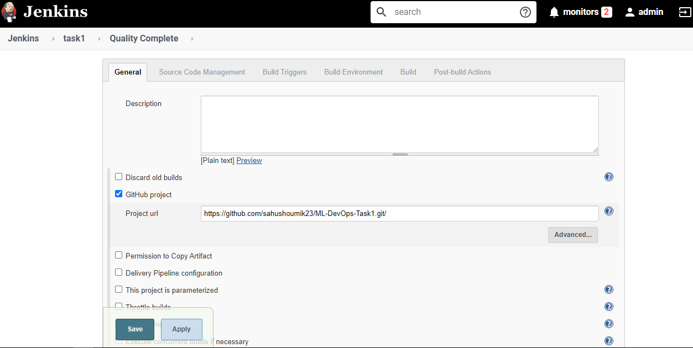

This project is dealing with a system that has three parts...

<h2>Part-1</h2>
  
This part involves 2 docker containers launched...One for master and one for the Testing...

  
  
  
  
  
 Now that container is created we need to setup jenkins with some jobs that will help us get the task done automated.

  
  I am also setting up Webhook for the GitHub Repo so that when something is pushed the github triggers the jenkins job...
  
 <h2>Setting Up Github Webhook</h2>
 
You should have ngrok tool that converts private IP to Public IP...

Next we need to setup in GitHub Repository...

<b>Now lets see the Jenkins configuration to be made...</b>

<h1>Jenkins Configurations</h1>

 There are three jobs made that will help us in achieveing a monitored automation system...

<ol>
  
 <li>
  
  <h1>Production Job</h1>
 
 

 
 
This part is done so that when Webhooks is triggered via master branch then this job runs...

 

 
 
I actually did this configuration of merging so that when production part is going on then before start branch gets merged with the master

 
 

 
 

 
 
 
    sudo cp -fvr * /root/task1
    
 Simply click on save and then apply and then this is done...
 
 </li>
 <li>
  <h1>Testing</h1>
  
  

  
  
  
  
This job is triggered via webhook when something is pushed in the dev branch...

  
  
  
    sudo cp -fvr * /root/task12
   </li>
   <li>
  <h2>QA trigger Job</h2>
  
  
 Once the push is done in the dev branch then, the QA team will check the webpage and then run the job...

  
  
  
  
  
  
  </li>
 </ol>
 
 
<h2>And With all this you just have a semi-automation system ready<h2>
  Feel free to contact on WhatsApp 9338455463(No calls plzz) if you have any doubt or suggestions.

